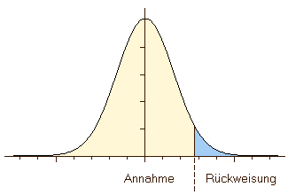

class: title-slide, center, middle

```{r setup, echo=F, error=FALSE, warning=F, message=F, results='hide'}
rm(list = ls())
options(digits = 3)
Sys.setlocale("LC_MESSAGES", "en_US.utf8")
```

```{r, echo = FALSE, results="asis"}
cat('# ', rmarkdown::metadata$title)
```

```{r, echo = FALSE, results="asis"}
cat('## ', rmarkdown::metadata$subtitle)
```

```{r, echo = FALSE, results="asis"}
cat('### ', rmarkdown::metadata$author)
```

```{r, echo = FALSE, results="asis"}
cat('#### ', rmarkdown::metadata$institute)
```

```{r, echo = FALSE, results="asis"}
cat(rmarkdown::metadata$date)
```

---

## Inductive statistics or statistical inference

**Is used to draw conclusions about (unknown) parameters of the population on basis of a sample**
The results are always statistical ;-)

i.e. all statements are true with a certain probability but could be also false with a certain probability

The basis of statistical inference is probability theory (stochastic)

---

## Population and sample [1]

### Repetition:
**Population**

Amount of all items of relevance for an analysis.

**Sample**

Selection of items on basis of certain criteria (e.g. representativity) which will be analysed instead of the population

The difference should always be kept in mind

In archaeology only sampling is possible! The population can never be investigated!

---

## Population and sample [2]

Features of the population: *parameters*

Parameters always exist, they have a certain value, but they are unknown and often (most of the time) also uncheckable.

**Example:**
.pull-left[
$\mu:$ mean of the population 

$\bar{x}$: mean of the sample
]

.pull-right[
$\sigma$: standard deviation of the population

$s$: standard deviation of the sample
]

In statistical tests only features of the sample could be checked. The quality of the statement of a test therefore depends on the choice of the sample (representativity)!

---
## Statistical hypothesis testing

### Validation of an assumption about the population

A assumption (hypothesis) about the population is made and than its probability is checked against the sample.

### Usual questions:

**How probable is it that two or more samples descend from the different/the same population?**

(eg. Is the custom of grave goods for man and women so different that two different social groups are visible?)

**How probable is it that a given sample descend from a population with certain parameters?**

(Is the amount of grave goods random or is a pattern visible?)

---

## Null hypothesis [1]

### Validation through falsification

In statistical tests most of the times not the statement is tested which one expects to be true but one tries to disprove the statement which one expects to be wrong: the null hypothesis.

This hypothesis states mostly, that a association do not exists or that there is no differences between the samples and the distribution of the observations is by chance.

Example: Is the composition of grave goods different between male and female deceased?

$H_0$: The compositionisthe same

$H_1$: The composition is different

### Reason
1. It is (logical) easier to prove, that a statement is wrong (falsify) then to prove that a statement is true (verify).
2. Most of the times it is easier to formulate a null hypothesis (How exactly is the composition different?). It doesn't make a assumption about how the character of a association/difference exactly is.

---

## Null hypothesis [2]

### „Workflow“ of a statistical test

**Construction of a alternative hypothesis:**

The composition of the grave goods is different between male and female deceased.

**Construction of the null hypothesis:**

The composition of the grave goods is the same in male and female burials.

**Test of the null hypothesis**

**If the result of the test is significant:**

Rejection of the null hypothesis, choice of the alternativ hypothesis. The composition of the grave goods is different between male and female deceased.
If the result of the test is not significant:

**The null hypothesis could not be rejected.**

We can not say if the composition of the grave goods is different between male and female deceased or not!

---

## One-tailed/Two-tailed hypothesis

### one-tailed oder two-tailed

Dependend on the question there could be a different number of alternative hypothesis.

**Example:**

*Is the number of grave goods in female burials higher than in male?*

One-tailed hypothesis, possible answers are yes or no.

*Is the number of grave goods in female burials different from male?*

Two-tailed hypothesis, possible answers smaller-equal-greater.

That's why in statistical tests the result is often two significances (onetailed, two-tailed).
.center[
 
]

---

## Stat. Significance

### How true is true?

Statistical significance is effectively a measurement how probable a error is.

On basis of the significance the null hypothesis will be rejected and the alternative hypothesis will be choosen … or not.

There are classic boundary values for significance (significance levels):

0.05: significant, with 95% probability the decision is right.

0.01: very significant, with 99% probability the decision is right.

0.001: highly significant, with 99,9% probability the decision is right.

Often named with p-value or $\alpha$.

---
## α- und β-error [1]

### If statistics go wrong...

There are two kinds of possible errors:

**The null hypothesis was rejected although it is true** -> *Type I error, false positive, $\alpha$-error*

The result of a pregnancy test is false positive if it shows a pregnancy although there is none.

**The null hypothesis was not rejected although it is wrong** -> *Type II error, false negative, $\beta$-error*

The result of a pregnancy test is false negative if it shows no pregnancy although there is one.

| | True condition: H0 (There is no difference) | True condition: H1 (There is a difference) | 
|-|-|-|
| By the use of a statistical test the decision was made for: H0 | Correct decision | Type II error |
| By the use of a statistical test the decision was made for: H1 | Type I error  | Correct decision |

---
## α- und β-error [2]

### Tests and errors

**Statistical tests should avoid both types of errors**

balancing act (not to strict/not strict enought)

**General Type I Errors are more serious than Type II Errors**

This type leads to wrong assuptions because with it the alternative hypothesis seems to be proven, in case of a Type I Error nothing is proven

**Power of a test**

A test has more power if he avoids Type II Errors without risking more Type I errors.

A more powerful test helps to clarify issues better

---

## Nonparametric tests

### Parametric vs. nonparametric

**Parametric**: The distribution of the values have to be in a certain form (e.g. normal distribution); assumptions about the distribution of the population are needed

**non-parametric**: no assumptions about the distribution of the sample and the population are needed

### Nonparametric tests, advantages and disadvantages:

**Advantage**: Also appropriate if no statements about the distribution are possible or the distribution fits no for parametric tests.

Also smaller samples are possible.

**Disadvantages**: Tests have general a lesser power.

---
## Kolmogorov–Smirnov test

.pull-left[
.right[

.caption[
.tiny[
https://commons.wikimedia.org/wiki/File:Andrej_Nikolajewitsch_Kolmogorov.jpg
]
]
]
]
.pull-right[

.caption[
.tiny[
https://de.wikipedia.org/wiki/Datei:Smirnoff_vodka.jpg
]
]
]

---

## Kolmogorov-Smirnov-Test [1]

### Test for difference of two distributions

**requirements**: at least one ordinal scaled Variable (one sample case) and 1 nominal scaled grouping variable (two sample case)

**Procedure one sample case**: the culmulative procentual frequency of the sample is compared with a standard distribution (often normal distribution)

**Procedure two sample case**: the culmulative procentual frequencies of the samples is compared

---

## Kolmogorov-Smirnov-Test [2]

### Example (after Shennan)

Female bronze age burials in a grave yard by age

```{r echo=FALSE}
graeberbrz <- read.csv2("graeberbrz.csv", row.names = 1)
library(magrittr)
library(kableExtra)
library(reshape2)

graeberbrz.table <- as.data.frame(table(graeberbrz))
graeberbrz.table$alter <- factor(graeberbrz.table$alter, labels =  c("infans I", "infans II", "juvenilus", "adultus", "maturus", "senilis"))
levels(graeberbrz.table$reichtum) <- c("rich", "poor")

knitr::kable(addmargins(acast(graeberbrz.table, alter ~ reichtum, value.var = "Freq"),1))  %>%
  kable_styling(bootstrap_options = c("striped", "hover"),
                latex_options = "striped",
                full_width = T)
```

**Question**: Differ the live conditions of poor and rich buried people that much so that different life ages were reached?

---

## Kolmogorov-Smirnov-Test [3]

### requirements

$H_0$: There is no difference between rich and poor graves according to age of death.

$H_1$: There is a difference between rich and poor graves according to age of death.

Two-tailed test.

**Level of significance**: 0.05

**variables**:

1. ordinal scaled age classes
2. (at least) nominale (ordinale) scaled wealth classes

---

## Kolmogorov-Smirnov-Test [4]

**Procedure**: Calculation of the procentual frequency

Divide every cell of a column by the sum of the column

```{r echo=FALSE}
graeberbrz.table.cast <- data.frame(acast(graeberbrz.table, alter ~ reichtum, value.var = "Freq"))
graeberbrz.table.cast$poor_ratio <- graeberbrz.table.cast$poor/sum(graeberbrz.table.cast$poor)
graeberbrz.table.cast$rich_ratio <- graeberbrz.table.cast$rich/sum(graeberbrz.table.cast$rich)

graeberbrz.table.cast <- graeberbrz.table.cast[,c(1,4,2,3)]

knitr::kable(addmargins(as.matrix(graeberbrz.table.cast),1))  %>%
  kable_styling(bootstrap_options = c("striped", "hover"),
                latex_options = "striped",
                full_width = T)
```

---

## Kolmogorov-Smirnov-Test [5]

**Procedure**: Calculate the culmulative procentual frequency

Add to every procentual frequency the values of procentual frequencies
of the lower ordinal scaled values

```{r echo=FALSE}
graeberbrz.table.cast$poor_cumsum <- cumsum(graeberbrz.table.cast$poor_ratio)
graeberbrz.table.cast$rich_cumsum <- cumsum(graeberbrz.table.cast$rich_ratio)

graeberbrz.table.cast <- graeberbrz.table.cast[,c(1,2,6,3,4,5)]

knitr::kable(addmargins(as.matrix(graeberbrz.table.cast),1))  %>%
  kable_styling(bootstrap_options = c("striped", "hover"),
                latex_options = "striped",
                full_width = T)
```

---

## Kolmogorov-Smirnov-Test [6]

**Procedure**: Calculate the differences of the culmulative procentual frequencies

Substract the culmulative procentual frequencies from each other, make that value absolute (without sign)

```{r echo=FALSE}
graeberbrz.table.cast$difference <- abs(graeberbrz.table.cast$poor_cumsum - graeberbrz.table.cast$rich_cumsum)

graeberbrz.table.cast <- graeberbrz.table.cast[,c(3,6,7)]

knitr::kable(graeberbrz.table.cast)  %>%
  kable_styling(bootstrap_options = c("striped", "hover"),
                latex_options = "striped",
                full_width = T) %>% row_spec(which.max(graeberbrz.table.cast$difference), background="lightsalmon")
```

Find the largest difference.

---

## Kolmogorov-Smirnov-Test [7]

Compare the maximum difference with a boundary value which is calculated from the total number of cases

.pull-left[
```{r echo=FALSE, results="asis"}
sum_rich <- sum(graeberbrz.table$Freq[graeberbrz.table$reichtum=="rich"])
sum_poor <- sum(graeberbrz.table$Freq[graeberbrz.table$reichtum=="poor"])
cat(paste("\n\nTotal number rich:", sum_rich))
cat(paste("\n\nTotal number poor:", sum_poor))
cat(paste("\n\nDifference max (D_max):", round(max(graeberbrz.table.cast$difference),3)))
```
]

.pull-right[
Formula:

$boundary-value = f * \sqrt{\frac{n_1 + n_2}{n_1 * n_2} }$

Factor f:

- Level of significance 0.05: 1.36
- Level of significance 0.01: 1.63
- Level of significance 0.001: 1.95
]


That's why: $boundary-value = 1.36 * \sqrt{\frac{`r sum_rich` + `r sum_poor`}{`r sum_rich` * `r sum_poor`} } = `r 1.36 * sqrt((sum_rich + sum_poor)/(sum_rich * sum_poor))`$

`r 1.36 * sqrt((sum_rich + sum_poor)/(sum_rich * sum_poor))` > `r round(max(graeberbrz.table.cast$difference),3)`, difference is not significant

**But: That doesn't mean that the distributions are equal, only that they do not differ significant.**

---

## Kolmogorov-Smirnov-Test [8]

### KS-Test in R, prepare the dataset
.small[
.pull-left[
```{r}
graeberbrz <- read.csv2("graeberbrz.csv",
                        row.names = 1)
table(graeberbrz)
```
]

.pull-right[
```{r}
alter<-graeberbrz$alter
head(alter)
reichtum<-graeberbrz$reichtum
head(reichtum)
```
]
]
---

## Kolmogorov-Smirnov-Test [9]

### KS-Test in R, the test itself

```{r echo=F}
options(digits = 5)
```

```{r}
ks.test(alter[reichtum=="arm"],
        alter[reichtum=="reich"]
        )
```

---
class:inverse

## Excercise
### Cups from 'relative closed' finds from late neolithic inventories (Müller 2001)

Analyse with the Kolmogorov-Smirnov-Test if the heigths of cups with and without corner points differ significant on a 0.05-level.

File: mueller2001.csv

---


## Mann-Whitney-U-Test

.center[
  
]

.footnote[
.tiny[
* https://commons.wikimedia.org/wiki/File:Female_(801864)_-_The_Noun_Project.svg
* https://commons.wikimedia.org/wiki/File:Whitney%27s_Signature.png
* https://commons.wikimedia.org/wiki/File:Ubahnlogo.svg
]
]

---

## Mann-Whitney-U-Test [1] (=Wilcoxon rank-sum test)

### Test for differences of two distributions

**Requirements**: at least 1 interval- or ordinale scaled variable and 1 nominale scaled grouping variable

**Procedure**: The values were sorted and for every group the ranks were compared

---

## Mann-Whitney-U-Test [2]

### Example (after Müller-Scheeßel)

Chamber sizes of iron age chamber burials by sex

```{r echo=FALSE}
kammergroesse <- read.csv2("kammergroesse_mueller-scheessel.csv")

knitr::kable(kammergroesse)  %>%
  kable_styling(bootstrap_options = c("striped", "hover"),
                latex_options = "striped",
                full_width = T)
```

Question: Do the sizes differ in relation to the sex of the buried?

---

## Mann-Whitney-U-Test [3]

**Procedure**: Determination of the rank of the graves according to size

```{r echo=FALSE}
kammergroesse$rank <- rank(-kammergroesse$kammergroesse)

knitr::kable(kammergroesse)  %>%
  kable_styling(bootstrap_options = c("striped", "hover"),
                latex_options = "striped",
                full_width = T)
```

---

## Mann-Whitney-U-Test [4]

**Procedure**: Sort according to rank

```{r echo=FALSE}
kammergroesse <- kammergroesse[order(kammergroesse$rank),]

knitr::kable(kammergroesse)  %>%
  kable_styling(bootstrap_options = c("striped", "hover"),
                latex_options = "striped",
                full_width = T)
```

---

## Mann-Whitney-U-Test [5]

Count how many values of the opposite category are below the actual value, and sum.
.small[
```{r echo=FALSE}

count_below <- function(y, string) {
  sapply(1:nrow(y),function(x) {
  this_set <- tail(y, n = nrow(y) - x)
  sum(this_set$geschlecht==string)
}
)
}

male_below <- count_below(kammergroesse, "m")

female_below <- count_below(kammergroesse, "w")

kammergroesse$m_below <- ""
kammergroesse$m_below[kammergroesse$geschlecht=="w"] <- male_below[kammergroesse$geschlecht=="w"]

kammergroesse$f_below <- ""
kammergroesse$f_below[kammergroesse$geschlecht=="m"] <- female_below[kammergroesse$geschlecht=="m"]

knitr::kable(kammergroesse)  %>%
  kable_styling(bootstrap_options = c("striped", "hover"),
                latex_options = "striped",
                full_width = T)
```
]
Sums:

m_below: `r sum(as.numeric(kammergroesse$m_below), na.rm=T)`

f_below: `r sum(as.numeric(kammergroesse$f_below), na.rm=T)`

---
## Mann-Whitney-U-Test [6]

**Procedure**

Number of male burials: `r sum(kammergroesse$geschlecht=="m")`

Number of female burials: `r sum(kammergroesse$geschlecht=="w")`

Rank sum of male burials: `r sum(as.numeric(kammergroesse$m_below), na.rm=T)`

Rank sum of female burial: `r sum(as.numeric(kammergroesse$f_below), na.rm=T)`

`r sum(kammergroesse$geschlecht=="m")`*`r sum(kammergroesse$geschlecht=="w")`=`r sum(kammergroesse$geschlecht=="m") * sum(kammergroesse$geschlecht=="w")`=`r sum(as.numeric(kammergroesse$m_below), na.rm=T)` + `r sum(as.numeric(kammergroesse$f_below), na.rm=T)`

The smaller value will be evaluated: `r min(sum(as.numeric(kammergroesse$f_below), na.rm=T), sum(as.numeric(kammergroesse$m_below), na.rm=T))`

Look up in a table (e.g. Shennan 1997, Table B):

Boundary value for significance 0.05 when n1=5 and n2=5: 2

The chamber sizes do differ from each other significantly.

---

## Mann-Whitney-U-Test in R
.tiny[
```{r }
kammergroesse<-read.csv2("kammergroesse_mueller-scheessel.csv")
kammergroesse
wilcox.test(kammergroesse$kammergroesse ~ kammergroesse$geschlecht)
```
]

---
class:inverse

## Excercise
### Length of flanged axes of types Bikun and Cegun (Cullberg 1968)

Analyse with the Mann-Whitney-U-Test if the length of flanged axes of the types Bikun and Cegun differ significant on a 0.05-level.

file: cullberg1968.csv

---

## Interpretation of significance tests

### Pay attention also when the statistic seem to be clear

**After the test as well as before the test: The interpretation determines the result!**

**Statistically significant ≠ archaeologically significant!**

**Statistical results stay statistical: significance is always probability that the choice of a hypothesis is correct, but there is also a probability that it is by chance...**