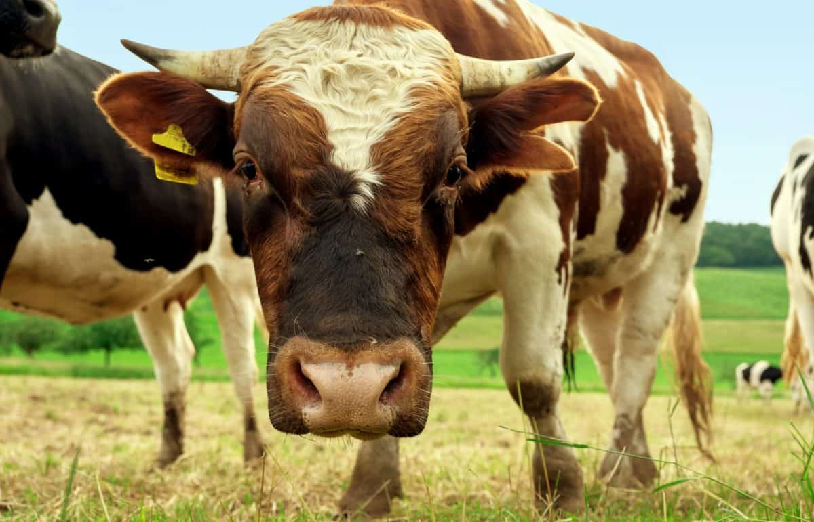
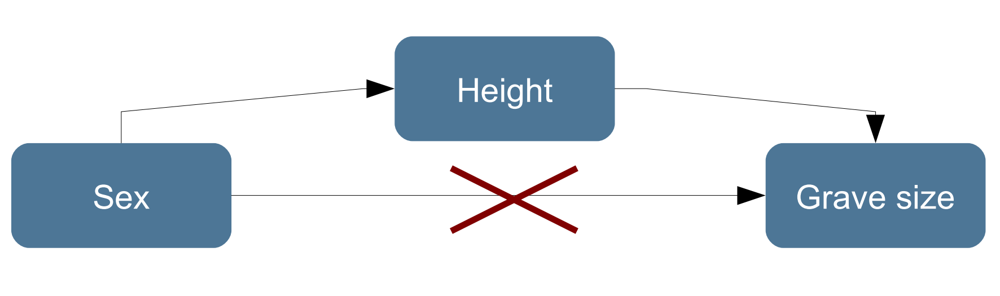

class: title-slide, center, middle

```{r setup, echo=F, error=FALSE, warning=F, message=F, results='hide'}
rm(list = ls())
#options(digits = 3)
Sys.setlocale("LC_MESSAGES", "en_US.utf8")
```

```{r, echo = FALSE, results="asis"}
cat('# ', rmarkdown::metadata$title)
```

```{r, echo = FALSE, results="asis"}
cat('## ', rmarkdown::metadata$subtitle)
```

```{r, echo = FALSE, results="asis"}
cat('### ', rmarkdown::metadata$author)
```

```{r, echo = FALSE, results="asis"}
cat('#### ', rmarkdown::metadata$institute)
```

```{r, echo = FALSE, results="asis"}
cat(rmarkdown::metadata$date)
```

---

## Repetition: Statistical hypothesis testing

### Validation of an assumption about the population

A assumption (hypothesis) about the population is made and than its probability is checked against the sample.

### Usual questions:

**How probable is it that two or more samples descend from the different/the same population?**

(eg. Is the custom of grave goods for man and women so different that two different social groups are visible?)

.right[*Two samples, Test for independence*]

**How probable is it that a given sample descend from a population with certain parameters?**

(Is the amount of grave goods random or is a pattern visible?)

.right[*One sample, Goodness-of-fit-Test*]

---

## Repetition: Nonparametric tests

### Parametric vs. nonparametric

**Parametric**: The distribution of the values have to be in a certain form (e.g. normal distribution); assumptions about the distribution of the population are needed

**non-parametric**: no assumptions about the distribution of the sample and the population are needed

### Nonparametric tests, advantages and disadvantages:

**Advantage**: Also appropriate if no statements about the distribution are possible or the distribution fits no for parametric tests.

Also smaller samples are possible.

**Disadvantages**: Tests have general a lesser power.

---

## $\chi^2$ test
.center[
( - tai)^2
]

---

## $\chi^2$ test [1]


### Possible Questions

**Do settlements tend to be situated on rather good soil or is the distribution random?**

Conclusions about settlement behaviour and economy would be possible

**Do older individuals have more shoe-last celt as grave goods than younger?**

If shoe-last celt would be signs of social rank than this situation would make conclusions possible about heredity or acquisition of social rank during life time.

**Tests for nominal scaled variables are possible!**

Therefore of particular value for archaeology because we have often to deal with such data.

---

## $\chi^2$ test [2]

### Test for independence of two distributions

**Requirements**: at least 1 nominal scaled variable (one sample case) and
1 nominal scaled grouping variable (two sample case)

**Procedure with one sample**: observed values are compared with expected values given a certain distribution, no expected value should be < 5; n should be > 50

**Procedure with two samples**: observed values of both distributions are
compared with expected values if the samples would be even distributed,
no expected value should be < 5; n should be > 50

**Test statistics**: $\chi^2$

Significance depend on degree of freedom (df)

---

## Excursus degree of freedom

Number of slots free to vary given the margin sums

| | male | female | total |
|-|-|-|-|
| cremation |  | |  201 |
| inhumation | | | 197 |
| total | 216 | 182 | 398 |

---

## Excursus degree of freedom

Number of slots free to vary given the margin sums

| | male | female | total |
|-|-|-|-|
| cremation | 123 | |  201 |
| inhumation | | | 197 |
| total | 216 | 182 | 398 |

---

## Excursus degree of freedom

Number of slots free to vary given the margin sums

| | male | female | total |
|-|-|-|-|
| cremation | 123 | 78 |  201 |
| inhumation | 93 | 104 | 197 |
| total | 216 | 182 | 398 |

**df=1**: if one value is chosen all other can be calculated with the help of
the margins

(number of columns – 1)*(number of rows – 1)

---

## Excursus degree of freedom

Number of slots free to vary given the margin sums

| | male | female | uncertain | total |
|-|-|-|-|
| cremation |  |  | |  201 |
| inhumation |  | | | 197 |
| total | 196 | 179 | 23 | 398 |

---

## Excursus degree of freedom

Number of slots free to vary given the margin sums

| | male | female | uncertain | total |
|-|-|-|-|
| cremation |  | 78 | |  201 |
| inhumation |  | | | 197 |
| total | 196 | 179 | 23 | 398 |

---

## Excursus degree of freedom

Number of slots free to vary given the margin sums

| | male | female | uncertain | total |
|-|-|-|-|
| cremation | 113 | 78 | |  201 |
| inhumation |  | | | 197 |
| total | 196 | 179 | 23 | 398 |

---

## Excursus degree of freedom

Number of slots free to vary given the margin sums

| | male | female | uncertain | total |
|-|-|-|-|
| cremation | 113 | 78 | 10 |  201 |
| inhumation | 83 | 101 | 13 | 197 |
| total | 196 | 179 | 23 | 398 |

**df=2**: if two values are chosen all other can be calculated with the help of the margins

(number of columns – 1)*(number of rows – 1)

---

## Excursus degree of freedom

Number of slots free to vary given the margin sums

| | male | female | uncertain | total |
|-|-|-|-|
| cremation |  |  | |  201 |
| inhumation |  | | | 197 |
| other |  | | | 30 |
| total | 201 | 187 | 40 | 428 |

---

## Excursus degree of freedom

Number of slots free to vary given the margin sums

| | male | female | uncertain | total |
|-|-|-|-|
| cremation |  | 78 | |  201 |
| inhumation | 83 | | 13 | 197 |
| other |  | 8 | | 30 |
| total | 201 | 187 | 40 | 428 |

---

## Excursus degree of freedom

Number of slots free to vary given the margin sums

| | male | female | uncertain | total |
|-|-|-|-|
| cremation | 113 | 78 | 10 |  201 |
| inhumation | 83 | 101 | 13 | 197 |
| other | 5 | 8 | 17 | 30 |
| total | 201 | 187 | 40 | 428 |

---

## $\chi^2$ test [3]

### Test for one sample (example after Shennan)

Numbers of neolithic settlements by soil type in eastern france

| Soil type | Number of settlements |
| - |-|
| Rendzina | 26 |
| Alluvial | 9 |
| Brown earth | 18 |
| total | 53 |

Question: Is there a significant preference for a soil type?

We calculate two versions:

*1. even distributed*

*2. even distributed with consideration of the proportion of the soil types on the total area*

---

## $\chi^2$ test [4]

### Version 1: even distributed

| Soil type | Number of settlements | Proportion of soil type | expected number of settlements |
| - |-| - | - |
| Rendzina | 26 | 1/3 | 17.6667 |
| Alluvial | 9 | 1/3 | 17.6667 |
| Brown earth | 18 | 1/3 | 17.6667 |
| total | 53 | 1 | 53 |


$H_0$: The settlements are evenly distributed on all soil types.

$H_1$: The settlements are **not** evenly distributed on all soil types.

---

## $\chi^2$ test [5]

### Version 1: even distributed

| Soil type | Number of settlements | Proportion of soil type | expected number of settlements |
| - |-| - | - |
| Rendzina | 26 | 1/3 | 17.6667 |
| Alluvial | 9 | 1/3 | 17.6667 |
| Brown earth | 18 | 1/3 | 17.6667 |
| total | 53 | 1 | 53 |

Formula for $\chi^2$:

$\chi^2=\sum_{i=1}^n \frac{(O_i - E_i)^2}{E_i}$

$O_i$: number of **observed** cases

$E_i$: number of **expected** cases

$\chi^2$: symbol for the test statistic chi-squared

---

## $\chi^2$ test [6]

**Procedure: Calculation of the Χ²-value**

$\chi^2=\sum_{i=1}^n \frac{(O_i - E_i)^2}{E_i}$

| Soil type | Number of observed cases | Number of expected cases | $O_i - E_i$ | $(O_i - E_i)^2$ | $\frac{(O_i - E_i)^2}{E_i}$ |
| - |-| - | - |
| Rendzina | 26 | 17.6667 | 8.3333 | 69,4444 | 3.9308 |
| Alluvial | 9 | 17.6667 | -8.6667 | 75,1117 | 4.2516 |
| Brown earth | 18 | 17.6667 | 0.3333 | 0.1111 | 0.0063 |
| total | 53 | 53 | | | **8.18868** |

**Look up in a table (e.g. Shennan):**
Df=2 (2 colums (expected, observed), 3 categories)

Level of significance: 0.05

Boundary value: 5.99145

**Significant result: The distribution is uneven!**

---

## $\chi^2$ test [7]

### Version 2: even distributed with consideration of the proportion of the soil types on the total area

| Soil type | Number of settlements | Proportion of soil type | expected number of settlements |
| - |-| - | - |
| Rendzina | 26 | 32% | 16.69 |
| Alluvial | 9 | 25% | 13.25 |
| Brown earth | 18 | 34% | 22.79 |
| total | 53 | 1 | 53 |

$\chi^2=\sum_{i=1}^n \frac{(O_i - E_i)^2}{E_i}$

---
## $\chi^2$ test [8]

**Procedure: Calculation of the Χ²-value**

$\chi^2=\sum_{i=1}^n \frac{(O_i - E_i)^2}{E_i}$

| Soil type | Number of observed cases | Number of expected cases | $O_i - E_i$ | $(O_i - E_i)^2$ | $\frac{(O_i - E_i)^2}{E_i}$ |
| - |-| - | - |
| Rendzina | 26 | 16.69 | 9.04 | 81.7216 | 4.8185 |
| Alluvial | 9 | 13.25 | -4.25 | 18.0625 | 1.1363 |
| Brown earth | 18 | 22.79 | -4.79 | 22.9441 | 1.007 |
| total | 53 | 53 | | | **7.1885** |

**Look up in a table (e.g. Shennan):**
Df=2 (2 colums (expected, observed), 3 categories)

Level of significance: 0.05

Boundary value: 5.99145

**Significant result: The distribution is uneven also if we consider the proportions of the soil types!**

---

## $\chi^2$ test [9]

.small[
```{r}
siedlungen<-c(26,9,18)
names(siedlungen)<-c("Rendzina","Alluvial","Braunerde")
siedlungen
```

Version 1: even distributed
```{r}
chisq.test(siedlungen)
```

Version 2: even distributed with consideration of the proportion of the soil types on the total area
```{r}
chisq.test(siedlungen,p=c(0.32,0.25,0.43))
```
]

---

## $\chi^2$ test [10]

### Two sample case (Test for independence)

*(example after Hinz, beautified)*

Comparison of amber in graves and settlements

Classic 2x2 situation

| Type of site | amber || total |
| - | - | - | - |
| | + | - | |
| settlement | 6 | 18 | 24 |
| grave | 132 | 44 | 176 |
| total | 138 | 62 | 200 |

**Is amber primary a grave good?**

df=1

Level of significance = 0.05

---

## $\chi^2$ test [11]

### Procedure: Calculation of the expected values

Multiply the margins and divide the result by the total number

| Type of site | amber || total |
| - | - | - | - |
| | + | - | |
| settlement | 24*138/200 = 16.56 | 24*62/200=7.44 | 24 |
| grave | 138*176/200=121.44 | 62*176/200=54,56 | 176 |
| total | 138 | 62 | 200 |

---

## $\chi^2$ test [12]

### Procedure: Calculation of the expected values

Multiply the margins and divide the result by the total number

| Type of site | amber || total |
| - | - | - | - |
| | + | - | |
| settlement | O=6 vs. E=16.56 | O=18 vs. E=7.44 | 24 |
| grave | O=132 vs. E=121.44 | O=44 vs. E=54.56 | 176 |
| total | 138 | 62 | 200 |

$\chi^2=\sum_{i=1}^n \frac{(O_i - E_i)^2}{E_i}$

---

## $\chi^2$ test [13]

### Procedure: Calculation of the expected values

$\chi^2=\sum_{i=1}^n \frac{(O_i - E_i)^2}{E_i}$

| Type of site | amber || total |
| - | - | - | - |
| | + | - | |
| settlement | (6-16.56)^2/16.56=6.73 | (18-7.44)^2/7.44=14.99 | 24 |
| grave | (132-121.44)^2/121.44=0.92 | (44-54.56)^2/54.56=2.04 | 176 |
| total | 138 | 62 | 200 |

**Is amber primary a grave good?**

Df=1, Level of significance = 0.05;

$\chi^2$=24,68; boundary value (df=1 and p=0.05): 3.84146

The difference in the distribution is significantly not by chance. Both variables are associated!

---

## $\chi^2$ test [14]

```{r}
amber<-matrix(c(6,132,18,44),ncol=2)
colnames(amber)<-c("with amber","without amber")
rownames(amber)<-c("settlement","grave")
amber
chisq.test(amber)
```

---

## $\chi^2$ test [15]

```{r}
chisq.test(amber)
chisq.test(amber,correct=F)
```

Correct: Yates correction for small samples → (|O-E|-0,5)²/E

---
class:inverse

## $\chi^2$ excercise

### Animal bones from middle and late neolithic strata in Wolkenwehe (Mischka et al. 2005)

The following counts are given

| layer | Domestic animal | Wild animal |
| - | - | - |
| 202 (late neolithic) | 159 | 32 |
| 203 (middle neolithic) | 84 | 54 |

Analyse if the observed differences are statistically significant!

---

## Measurement of association [1]

### Measurement of the strength of the association of two variables

$\chi^2$ is already a Measurment of association:

Association ↑ $\chi^2$ ↑ ↔ Association ↓ $\chi^2$ ↓

But: $\chi^2$ depends on n

.pull-left[
| Type of site | amber || total |
| - | - | - | - |
| | + | - | |
| settlement | 6 | 18 | 24 |
| grave | 132 | 44 | 176 |
| total | 138 | 62 | 200 |

$\chi^2$ = 24.6844

]
.pull-right[
| Type of site | amber || total |
| - | - | - | - |
| | + | - | |
| settlement | 12 | 36 | 48 |
| grave | 264 | 88 | 352 |
| total | 276 | 124 | 400 |

$\chi^2$ = 49.3689
]

---
## Cramers V (or $\phi$)

.center[
 
]

.footnote[
.tiny[
* https://commons.wikimedia.org/wiki/File:Harald_Cram%C3%A9r.jpeg
* https://pixnio.com/de/tiere/kuhe-kalber/kuh-rasen-vieh-ackerland-vieh-bauernhof-landwirtschaft
]
]

---

## Measurement of association [2]

### Cramers V

Normalise $\chi^2$ for the number of observations n,

Square root,

Divide by the smaller value of (number of rows, number of colums) -1

.pull-left[
| Type of site | amber || total |
| - | - | - | - |
| | + | - | |
| settlement | 6 | 18 | 24 |
| grave | 132 | 44 | 176 |
| total | 138 | 62 | 200 |

$\chi^2$ = 24.6844
]
.pull-right[
| Type of site | amber || total |
| - | - | - | - |
| | + | - | |
| settlement | 12 | 36 | 48 |
| grave | 264 | 88 | 352 |
| total | 276 | 124 | 400 |

$\chi^2$ = 49.3689
]
.center[
$\phi = \sqrt{\frac{\chi^2}{n∗(min(rows, columns)-1)}}$
]
---

## Measurement of association [2]

### Cramers V

Normalise $\chi^2$ for the number of observations n,

Square root,

Divide by the smaller value of (number of rows, number of colums) -1

.pull-left[
$\chi^2$ = 24.6844

$\phi = \sqrt{\frac{\chi^2}{n∗(min(rows, columns)-1)}}$

$\phi = \sqrt{\frac{24.6844}{200∗(min(2, 2)-1)}}$

$\phi = 0.3513$
]
.pull-right[
$\chi^2$ = 49.3689

$\phi = \sqrt{\frac{\chi^2}{n∗(min(rows, columns)-1)}}$

$\phi = \sqrt{\frac{49.3689}{400∗(min(2, 2)-1)}}$

$\phi = 0.3513$
]

---

## Measurement of association [3]

### Cramers V

$\phi = \sqrt{\frac{\chi^2}{n∗(min(rows, columns)-1)}}$

The value is between 0 and 1

0: no association

1: perfect association

```{r}
calc.CV <- function(x)
{
 CV <- sqrt(chisq.test(x, correct = FALSE)$statistic /
 (sum(x) * min(dim(x) - 1)))
 as.numeric(CV)
}
calc.CV(amber)
```

---

## Fishers Test [1]

Problem with to low expected values

| Type of site | amber || total |
| - | - | - | - |
| | + | - | |
| settlement | 12*69/100 = 8.28 | .red[12*31/100=3.72] | 12 |
| grave | 69*88/100=60.72 | 31*88/100=27.28 | 88 |
| total | 69 | 31 | 100 |

Smaller than 5, so $\chi^2$ not applicable.

---

## Fishers Test [2]

### Test for two samples (test for independence)
*(example after Hinz, orginal)*

Exact test after Fisher!

| Type of site | amber || total |
| - | - | - | - |
| | + | - | |
| settlement | a: 3 | b: 9 | 12 |
| grave | c: 66 | d: 22 | 88 |
| total | 69 | 31 | n: 100 |
.center[
$\phi = \frac{(a+b)!(c+d)!(a+c)!(b+d)!}{n!a!b!c!d!} = \frac{(3+9)!(66+22)!(3+66)!(9+22)!}{100!3!9!66!22!}$
]

---

## Fishers Test [3]

```{r}
amber_real <- amber/2
amber_real
fisher.test(amber_real)
```

---
class:inverse

## Fishers Test excercise

### Boar teeth in globular amphora graves (Müller 2001, numbers changed)

Given are the following numbers

| sex | Boar teeth ||
| - | - | - |
| | + | - |
| male | 11 | 7 |
| female | 1 | 6 |

Analyse if there is a significant association!

---

## Interpretation of Tests

### Statistical association not mean causal association!

Example after Shennan: Grave size and sex

Although there is a statistically significant association between grave size and sex this could be caused by a third factor (here height)

A conclusion which says that grave size are determined by sex would be wrong!

.center[

]