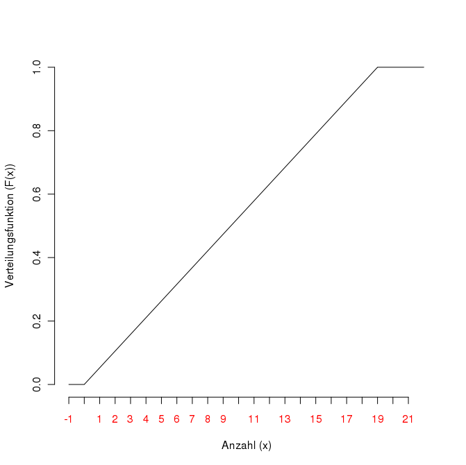
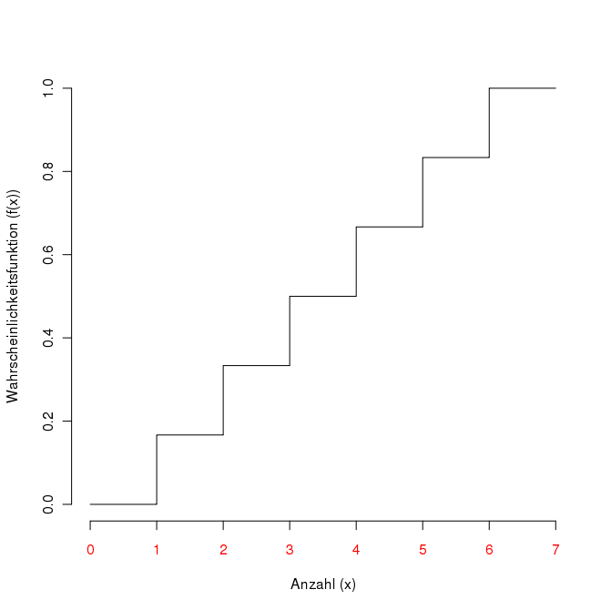

class: title-slide, center, middle

```{r setup, echo=F, error=FALSE, warning=F, message=F, results='hide'}
rm(list = ls())
#options(digits = 3)
Sys.setlocale("LC_MESSAGES", "en_US.utf8")
```

```{r, echo = FALSE, results="asis"}
cat('# ', rmarkdown::metadata$title)
```

```{r, echo = FALSE, results="asis"}
cat('## ', rmarkdown::metadata$subtitle)
```

```{r, echo = FALSE, results="asis"}
cat('### ', rmarkdown::metadata$author)
```

```{r, echo = FALSE, results="asis"}
cat('#### ', rmarkdown::metadata$institute)
```

```{r, echo = FALSE, results="asis"}
cat(rmarkdown::metadata$date)
```
---

## Repetition: Data, variables, values

- Variable:
  - What ist measured or analysed.
  - e.g. height
- item:
  - That whichs variable is measure
  - e.g. me as „possessor“ of a height, graves, persons...
- values:
  - The actual measurement.
  - e.g. my height is 1.81 m.
- discrete variable:
  - Variable which can take only certain values without intermediate values
  - e.g. income, counts of ceramic objects, sex (?)
- continuous Variablen:
  - Variable which can take all value and intermediate value
  - e.g. height, temperature, proportion value
---

## Distributions and continuity

.pull-left[
### Continuous distribution

Distribution in which all intermediate levels for a variable X are defined as continuously.



> a continuous function is a function for which sufficiently small changes in the input result in arbitrarily small changes in the output
]

.pull-right[
### Discrete distribution

Distribution showing "jumps"

]
---
## Theoretical distributions

Certain classes of events have certain distribution patterns

- Binominal distribution
- Poisson distribution
- Uniform distribution
- Normal distribution

Distributions are models based on processes with certain properties.

They are used to check these properties in real distributions and to estimate these real distributions in areas for which no data is available.
---

## Probability function (density function)

.pull-left[
Example tossing a coin

typical properties

**Expected value**: The value that is most probable.

**Dispersion**: The variance of distribution

more: Skewness and Kurtosis

$$ f(x_i) =
\begin{cases}
p(x_i=0) = \frac{1}{8}\newline
p(x_i=1) = \frac{3}{8}\newline
p(x_i=2) = \frac{3}{8}\newline
p(x_i=3) = \frac{1}{8}
\end{cases} $$
]

.pull-right[

```{r echo=FALSE}
x = c(0,1,1,1,2,2,2,3)
plot(prop.table(table(x)), type = "h", ylim = c(0,1), xlab = "number heads (x)", ylab= "probability f(x)")
```

]

---

## Cumulative distribution function

.pull-left[
Is the sum function of the probability function

"What is the probability of having up to two heads?"

Properties:

$0 \leq F(x) \leq 1$

F(x) is monotonous not falling

$F(x_1 ) \leq F(x_2 )... \leq F(x_n )$

$$ f(x_i) =
\begin{cases}
p(x_i \le 0) = 0\newline
p(x_i \leq 0) = \frac{1}{8}\newline
p(x_i \leq 1) = \frac{4}{8}\newline
p(x_i \leq 2) = \frac{7}{8}\newline
p(x_i \leq 3) = 1
\end{cases} $$
]

.pull-right[

```{r echo=FALSE}
x = c(0,1,1,1,2,2,2,3)
plot(1:5,c(0,cumsum(prop.table(table(x)))), type = "S", ylim = c(0,1), xlab = "number heads (x)", ylab= "probability F(x)", xaxt="n")
axis(1, at=1:5,labels=c("≤0", "≤1", "≤2", "≤3", "≤4"), col.axis="red")
```

]

---
## Binominal distribution [1]

Describes random experiments "with putting back" like coin tossing

Conditions:

There are exactly two possible mutually exclusive results (e.g. head or tail)

The probabilities for both exits are constant.

The individual attempts are independent of each other.

Properties:

General: $B_{n;k;p} = \binom{n}{k} * p^k * (1 - p)^{n-k}$ : Formula for the binominal distribution

n: number of observations
k: number of positive outcome
p:probability of a positive outcome

Expected value ('Mean value', Most likely value): $E(x) = \mu = n ∗ p$

Variance (Dispersion): $var(x) = \sigma^2 = n∗ p * q = n∗p * (1- p)$

Standard deviation : $sd(x) =  \sqrt{var(x)}$

---

## Binominal distribution [1]

There are exactly two possible mutually exclusive results (e.g. "male" or "female")

The probabilities for both exits are constant. Overall, we know from the culture that male burials are underrepresented (70% female graves, 30% male graves).

The individual tests are independent of each other.

Question: How likely is a set of results (e.g. 2x men, 5x women) (P(W)=0.7, P(M)=1-P(W)=0.3)?

$\frac{7!}{5! - (7-5)!} = 21 = \binom{7}{5}$

For 2x men and 5x women (total 7) there are 21 possibilities to arrange them (combination without putting back).

Since the events are mutually exclusive, but each of the combinations is a "positive result" for us, we can add the probabilities.


---
## Binominal distribution [1]

Since the events are mutually exclusive, but each of the combinations is a "positive result" for us, we can add the probabilities. At first, we calculate the probability of the individual even, and than we multiply it by the number of positive Events.

$p(WWMMMMM) = P(W) * P(W) * P(M) * P(M)* P(M) * P(M) * P(M)$

$p(WWMMMMM) = 0.7 * 0.7 * 0.3 * 0.3 * 0.3 * 0.3 * 0.3$

because all the other results are just as likely:

$p(2xW, 5xM) = 21 * 0.7 ^2 * (1-0.7)^{7-2} = 0,0250047$

General: $B_{n;k;p} = \binom{n}{k} * p^k * (1 - p)^{n-k}$

Expected value: $E(x) = \mu = n ∗ p; here: 7*0.7 = 4.9$

Variance (Dispersion): $var(x) = \sigma^2 = n∗ p * q = n∗p * (1- p); here: 7 * 0.7 * (1-0.7) = 1.47$

Standard deviation : $sd(x) =  \sqrt{var(x)}; therefore: 1.212435565$

in R:

```{r}
dbinom(x=2, size=7, prob = 0.7)
```

