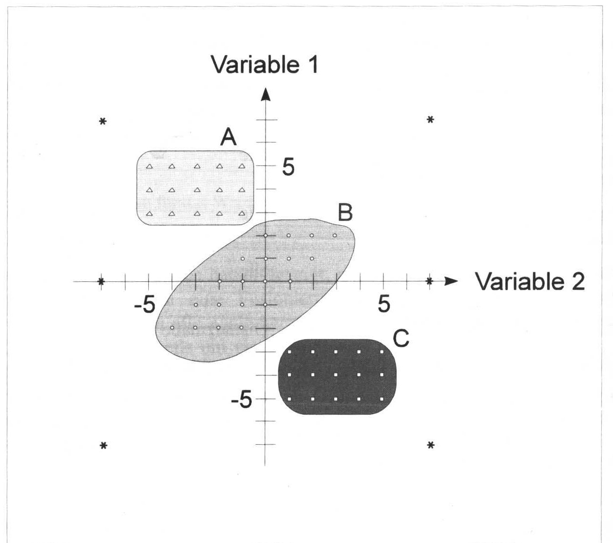
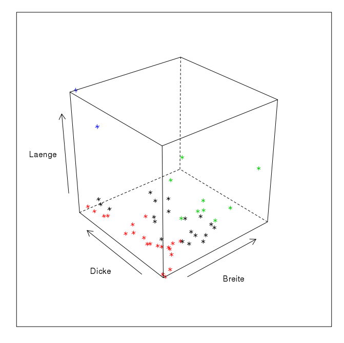
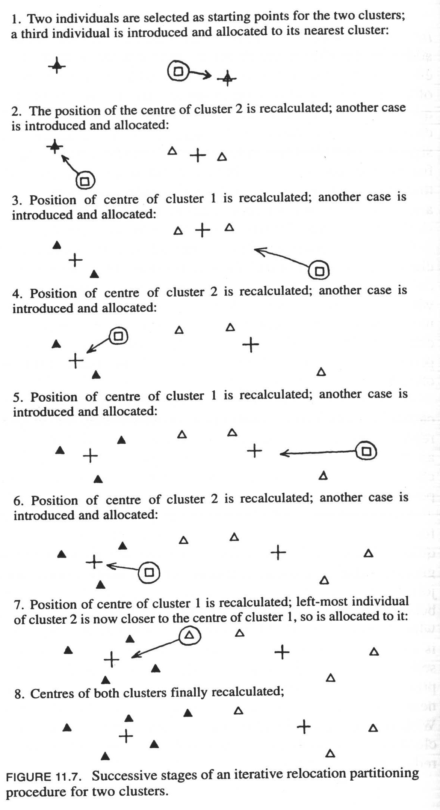
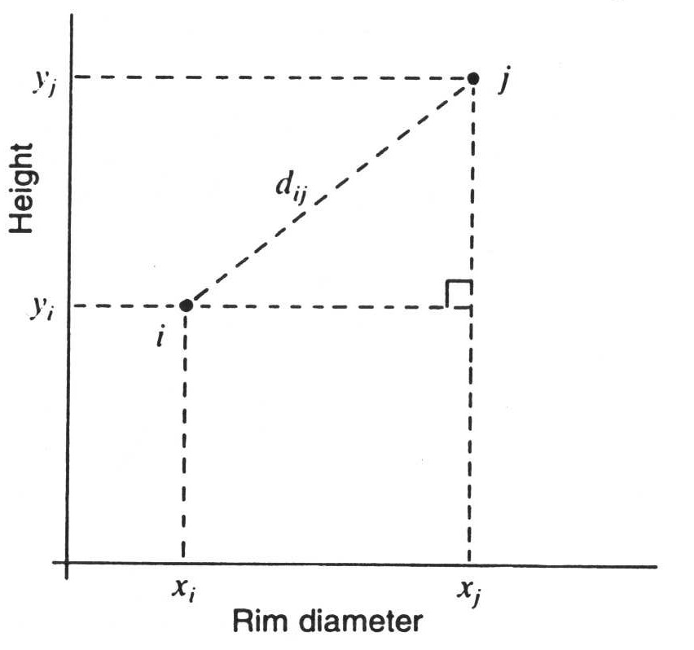
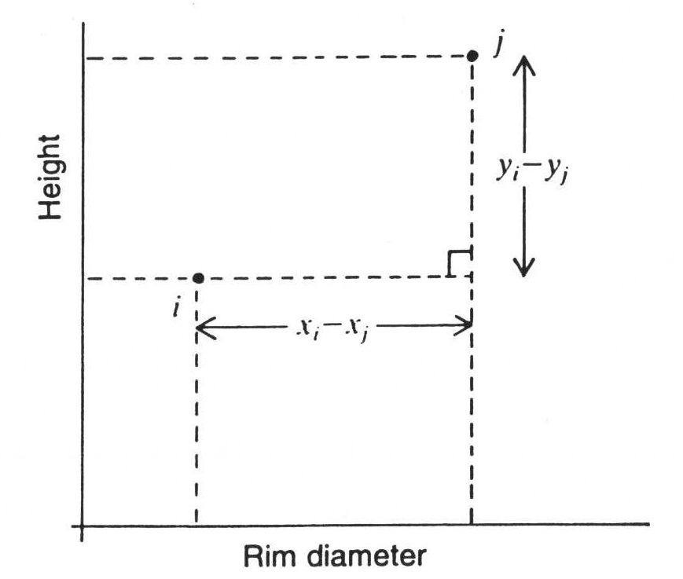

class: title-slide, center, middle

```{r setup, echo=F, error=FALSE, warning=F, message=F, results='hide'}
rm(list = ls())
#options(digits = 3)
Sys.setlocale("LC_MESSAGES", "en_US.utf8")
library(DiagrammeR)
```

```{r, echo = FALSE, results="asis"}
cat('# ', rmarkdown::metadata$title)
```

```{r, echo = FALSE, results="asis"}
cat('## ', rmarkdown::metadata$subtitle)
```

```{r, echo = FALSE, results="asis"}
cat('### ', rmarkdown::metadata$author)
```

```{r, echo = FALSE, results="asis"}
cat('#### ', rmarkdown::metadata$institute)
```

```{r, echo = FALSE, results="asis"}
cat(rmarkdown::metadata$date)
```
---

## Cluster Analysis: Idea and Basics

### Similar things have similar characteristics...
Group formation on the basis of characteristic attributes that (clearly?) distinguish them from other groups

Intuitive basis of archaeological work

With late 60s (New archaeology) request,
- to uncouple criteria for forming groups from subjective decisions
- enable processing of large, intuitively unmanageable amounts of data

→ multivariate analyses

### Cluster analysis
1. measurement of a distance (of any kind) between data
2. grouping data that is similar to each other and differentiating from data that are dissimilar 

→ Classification

---



---



---

## Cluster Analysis: Methods [1]

March separately, strike together... right?
Hierarchical

Which objects are most similar?

Which objects are 2. most similar?

Which objects are 3. most similar?
...

.pull-left[
### agglomerative

Starting from the smallest unit (individual objects)

Combine the two most similar to one object (1st cluster)

Combine the two most similar [Cluster|Objects].
...
]

.pull-right[
### divisive

Start with the largest possible unit (all objects as 1 cluster)

Divide them into two groups as dissimilar as possible

Divide one of the groups into two groups that are as dissimilar as possible.
...

]

Example: **Hierarchical clustering**, e.g. according to the Ward method

---

```{r, echo = FALSE, results="asis"}
grViz("digraph flowchart {
      # node definitions with substituted label text
      node [fontname = Helvetica, shape = rectangle]        
      tab1 [label = '@@1']
      tab2 [label = '@@2']
      tab3 [label = '@@3']
      tab4 [label = '@@4']
      tab5 [label = '@@5']
      tab6 [label = '@@6', shape=diamond]
      tab7 [label = '@@7']

      # edge definitions with the node IDs
      tab1 -> tab2 -> tab3 -> tab4 -> tab5 -> tab6;
      tab6 -> tab7 [label='yes'];
      tab6 -> tab3 [label='no'];
      }

      [1]: 'Start with\\nfinest partition'
      [2]: 'Calculate initial\\ndistance matrix'
      [3]: 'Search for the two\\nObjects/Clusters with the\\nleast distance'
      [4]: 'Combine the most similar\\nObjects/Clusters\\ninto one Cluster'
      [5]: 'Calculate new\\ndistance matrix'
      [6]: 'Are all objects\\njoint in one group?'
      [7]: 'Finished'
      ")
```

---


## Cluster Analysis: Methods [2]

Divide and rule... or?

Partitioning

What is the best way to divide the data into n groups?

Possible procedure:

1. select n cluster centers randomly.
2. combine data most similar to these cluster centers
3. recalculate the cluster centers if necessary
4. Does anything change?

If yes, again to 2.

Otherwise: ready!

Example: **kmeans clustering**

---
.center[

]
---

## Cluster Analysis: Methods [3]

### Hierarchical
*Advantage*: No number of clusters is specified, hierarchies of clusters can be observed (representation in a dendrogram)

*Disadvantage*: Once a solution has been found, it cannot be resolved again, even if the cluster is no longer optimal in a later step.

### Partitioning
*Advantage*: Clusters are still variable afterwards, i.e. if a better solution is found after a cluster cycle, this solution can be chosen.

*Disadvantage*: A cluster number is specified.

---

## Distance calculations: Euclidean distance (metric variables)

### How the crow flies

The closer two points are to each other, whose position in a coordinate system is determined by the values of the respective variables, the more similar the data sets are.

Calculation of the distance to each other:

Theorem of Pythagoras...

a2=b2+c2

The distance between two data with the variables x,y is thus:

$d_{ij} = \sqrt{(x_i - x_j)^2 + (y_i - y_j)^2}$

---



---



---

## Distance calculations: City-Block Distance (or Manhattan metric) (metric variables)

### How the taxi driver drives

Representation of the absolute distance between two objects

*Problem*: If the two variables are somehow interdependent, the resulting coordinate system is not rectangular.

Therefore, distances would be over- or underestimated with Euclidean metrics.

*Solution*: City block distance

The distance between two data with the variables x,y is thus:

$d_{ij} = |x_i - x_j| + |y_i -y_j|$

---
